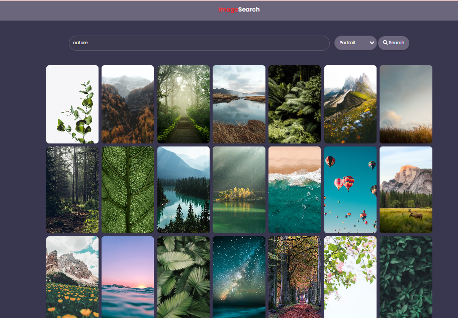

# Image Search Application (Educational Project)

This is a demonstration and educational project that allows users to search for high-quality images using a reverse-engineered API based on Unsplash. This project is not affiliated with Unsplash and is designed purely for learning purposes.




## Features

- User-friendly search interface.
- Responsive grid layout for image display.
- Pagination controls for easy navigation.
- Direct download option for high-resolution images.
- Smooth ripple loading animation during fetch.

## Prerequisites

- Modern web browser (Chrome, Firefox, Safari, Edge).

## Installation and Setup

1. **Clone the repository**:
   ```bash
   git clone https://github.com/your-username/image-search-app.git
   ```

2. **Navigate into the directory**:
   ```bash
   cd image-search-app
   ```

3. **Launch using a live server**:
   Utilize tools such as `Live Server` in VSCode or just open `index.html` in a web browser.

## Usage

1. Input your desired keyword in the search bar.
2. Click "Search" or simply press Enter.
3. Scroll through images and navigate with pagination controls.
4. Tap on an image's download icon to get the high-resolution variant.

## Technologies Used

- HTML5
- CSS3
- Pure JavaScript
- Reverse-engineered API inspired by Unsplash

## Contribution

Contributions, insights, and suggestions are welcome. Please keep in mind that this project is for educational purposes. Fork the repository and create a pull request if you have improvements or fixes.

## Educational Disclaimer

This application is created purely for educational and demonstration purposes. It uses a reverse-engineered API inspired by Unsplash. The intention is to provide a learning platform for individuals to understand web development techniques and not for commercial use. Respect all relevant terms of service and licensing when reviewing and using this software. This project is not affiliated, associated, authorized, endorsed by, or in any way officially connected with Unsplash or any of its subsidiaries or affiliates.

## Acknowledgements

Special thanks to the original design and inspiration from [Unsplash](https://unsplash.com). This project is an educational representation and not meant for commercial distribution.

